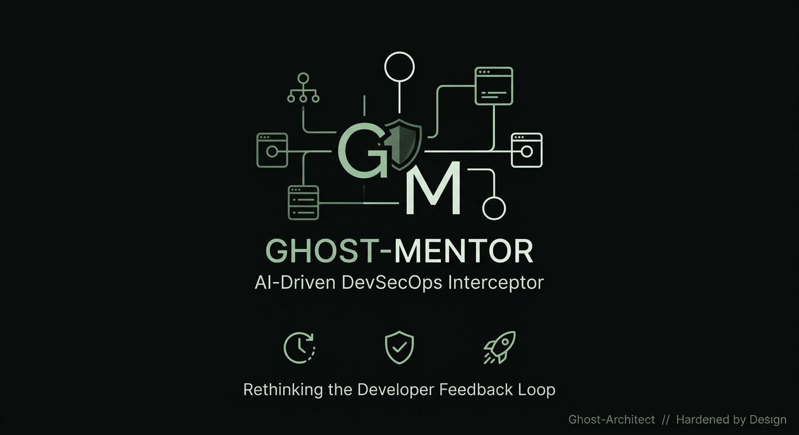
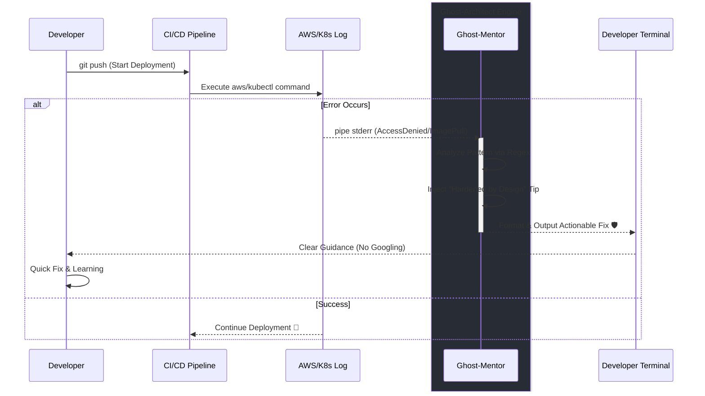

# 👻 Ghost-Mentor: AI-Driven DevSecOps Interceptor



**Ghost-Mentor** is a lightweight Python-based engine designed to bridge the gap between complex infrastructure failures and developer productivity. By intercepting pipeline errors in real-time, it provides actionable, **"Hardened by Design"** guidance directly in the terminal or CI/CD logs.

> "Solving Complex Problems with Elegance & Without Drama."

---

## 🏛️ Architectural Purpose
In a modern **OpEx-driven cloud**, technical friction is a financial leak. **Ghost-Mentor** reduces the 'Cognitive Load' on engineering teams by providing immediate architectural mentorship, preventing hours of wasted troubleshooting and ensuring every fix follows security best practices.

## 🚀 Key Features

* **Real-time Interception**: Acts as a runtime hook for Python environments or a pipe interceptor for AWS/K8s logs.
* **Actionable Mentorship**: Replaces cryptic tracebacks with clear, security-focused resolution steps.
* **Hardened by Design**: Every suggestion enforces industry standards (Least Privilege, Immutability, and Network Isolation).
* **Zero Dependencies**: Pure Python implementation, lightweight and ready for any CI/CD environment (Jenkins, GitHub Actions, GitLab CI).

## 🛠️ Supported Patterns & Hardening

| Domain | Pattern Detected | Hardened by Design Guidance |
| :--- | :--- | :--- |
| **AWS S3** | `AccessDenied` | S3 Block Public Access & Bucket Policy Hardening |
| **AWS IAM** | `Unauthorized` | Permission Boundaries & Least Privilege Analysis |
| **Docker** | `Auth Failures` | Registry Lifecycle & Rootless Container Best Practices |
| **Kubernetes** | `ImagePullBackOff` | PullSecret Scoping & Image Tag Standardization |
| **Kubernetes** | `CrashLoop` | Probes Configuration & Resource Limit Stability |

---

## 📦 How it Works (The Feedback Loop)


## 💻 Quick Start
1. Direct Integration (Python Hook)
Initialize Ghost-Mentor at the beginning of your script to intercept all unhandled exceptions:

```bash
from ghost_mentor import boot_mentor

boot_mentor()
# Your cloud logic here...
```
2. Pipeline Integration (CLI Pipe)
Redirect `stderr` to Ghost-Mentor in your CI/CD runner:# Example with Kubernetes Logs

```bash
# Example with AWS CLI
aws s3 cp file.txt s3://locked-bucket/ 2>&1 | python3 ghost_mentor.py
```

## 🛡️ Sovereignty & Philosophy
This tool is a core component of the Ghost-Architect ecosystem. Our mission is to transform DevOps into a "Hardened by Design" standard, where infrastructure is not just automated, but inherently secure and self-correcting.

---
*Built for the next paradigm of Cloud Engineering.*